# 🏡 Airbnb Bangkok Data Pipeline: End-to-End ELT & ML Project


---
## 📖 Table of Contents
1. [Project Overview](#-1-project-overview)
2. [Architecture & Workflow](#-2-architecture--workflow)
3. [Tech Stack & Tools](#-3-tech-stack--tools)
4. [Data Source & Dictionary](#-4-data-source--dictionary)
5. [Data Pipeline Implementation](#-5-data-pipeline-implementation)
6. [Machine Learning & GenAI Integration](#-6-machine-learning--genai-integration)
7. [Data Governance & Quality](#-7-data-governance--quality)
8. [Analytics & Dashboards](#-8-analytics--dashboards)
9. [Quick Start](#-9-quick-start-workflow-demo)

---

## 📌 1. Project Overview
An End-to-End ELT pipeline built to analyze the Airbnb market in Bangkok. This project automates the workflow from raw data ingestion to **advanced analytics and AI-driven insights** using the **Modern Data Stack**.

Instead of standard reporting, this project focuses on solving real-world data challenges: handling unstructured text/currency, enforcing **Data Governance** (PII masking), and running **Machine Learning & GenAI** directly within the Data Warehouse.

### 🎯 Key Objectives
* **Automated Orchestration:** End-to-end pipeline scheduled via **dbt Cloud** with daily data syncs and transformation jobs.
* **Data Transformation:** Modular **Star Schema** modeling with **SCD Type 2** snapshots to track historical changes in listings and prices.
* **Predictive Modeling:** In-database **XGBoost Regression** to estimate fair listing prices based on property features.
* **Advanced Analytics:** **K-Means Clustering** for market segmentation and **Isolation Forest** for detecting pricing anomalies.
* **GenAI Integration:** **Snowflake Cortex** (LLM) to perform Sentiment Analysis on guest reviews.
* **Governance & Resilience:** Enforced data integrity via **Automated Tests** (Schema validation & Business Logic checks like `price > 0`), secured PII with role-based **Dynamic Masking**, and ensured recoverability via **Snowflake Time Travel**.

## 🏗 2. Architecture & Workflow
The pipeline operates on a cloud-native **Modern Data Stack**, designed for scalability and modularity.

<p align="center">
  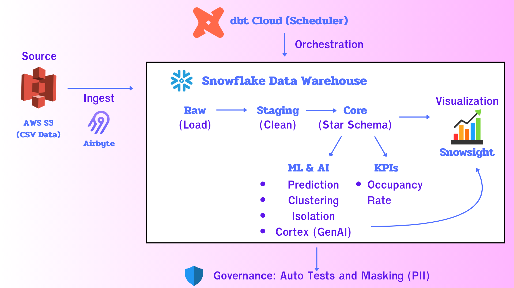
</p>

### 🔄 End-to-End Data Flow

#### 1. Data Ingestion (EL)
* **Source:** Raw Airbnb data (`Listings`, `Calendar`, `Reviews`) stored in **AWS S3**.
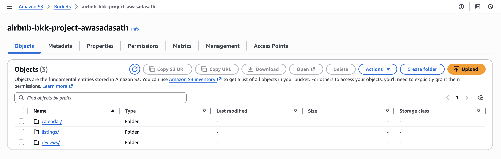
* **Ingestion:** **Airbyte** connects to S3 and syncs data into **Snowflake** (`RAW` Schema).
* **Execution:** Manual Trigger
* **Sync Mode:** Full Refresh - Overwrite

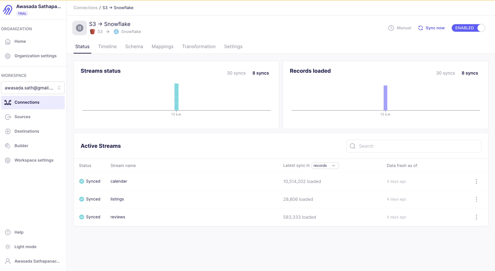

#### 2. Orchestration & Scheduling
* **Automation:** Pipeline scheduled via **dbt Cloud Jobs** (Daily at 07:00 AM).
> **Production Deployment:** Ensures data freshness without manual intervention.
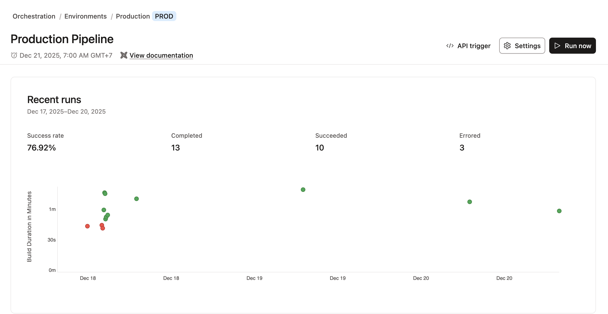

#### 3. Data Storage (Snowflake)
* **Raw Layer:** JSON/CSV data loaded by Airbyte.
* **Analytics Layer:** Organized into `Raw`, `Staging`, and `Core` schemas.
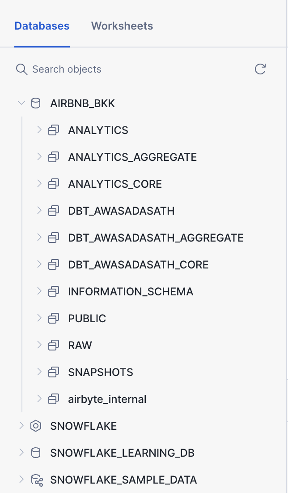

#### 4. Data Transformation (dbt)
Orchestrated by **dbt Cloud** using a layered approach:
* **Raw:** Defined sources pointing to immutable Airbyte-loaded data.
* **Staging:** Cleaning (Regex parsing, deduplication, casting) and standardization.
* **Core (Marts):** Star Schema modeling (`dim_listings`, `fct_reviews`, `fct_daily_activity`) and aggregated metrics for reporting.

> **Data Lineage:** Dependency graph including SQL and Python ML nodes.
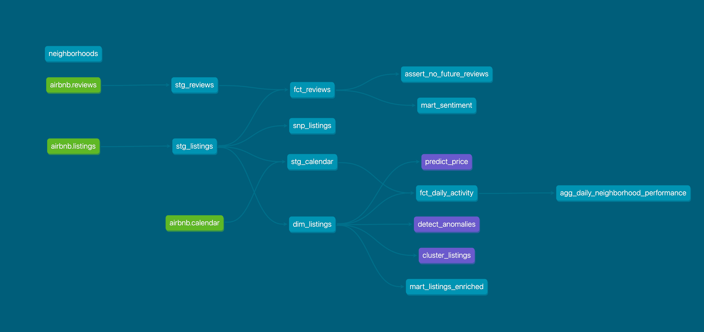

#### 5. Machine Learning & AI
* **Environment:** Python logic defined in **dbt Python models**, running natively on **Snowflake Compute** (via Snowpark).
* **Integration:** ML outputs (Predictions, Clusters, Isolation) are materialized as tables in the warehouse.

## 🛠 3. Tech Stack & Tools

| Category | Tool | Description |
| :--- | :--- | :--- |
| **Cloud Storage** |  | Data Lake for raw CSV files. |
| **Ingestion** |  | ELT tool to sync S3 to Snowflake. |
| **Data Warehouse** |  | Handles Storage, Compute, and ML workloads. |
| **Transformation** |  | Data modeling, testing, and documentation. |
| **Language** |  | In-database ML models (Scikit-learn, XGBoost). |
| **GenAI** |  | Managed LLM service for Sentiment Analysis. |
| **Orchestration** |  | Job scheduling and monitoring. |
| **Visualization** |  | Dashboards for metrics and ML results. |

---

### 📂 Project Directory Structure

```text
├── 📂 models
│   ├── 📂 staging          # Cleaning raw data (Regex, Casting)
│   ├── 📂 core             # Dimension & Fact tables (Star Schema)
│   ├── 📂 aggregate        # Final reporting metrics
│   └── 📂 machine_learning # Python scripts (Clustering, Prediction)
├── 📂 macros               # Custom SQL logic (clean_price)
├── 📂 seeds                # Static data (neighborhoods.csv)
├── 📂 snapshots            # SCD Type 2 tracking
├── 📂 tests                # Custom data quality checks
├── .gitignore
├── package.yml
├── package-lock.yml
└── dbt_project.yml         # Project configuration
```

## 📂 4. Data Source & Dictionary
Dataset sourced from **Inside Airbnb** (Bangkok). It includes three primary files with complex schemas.

<p align="center">
  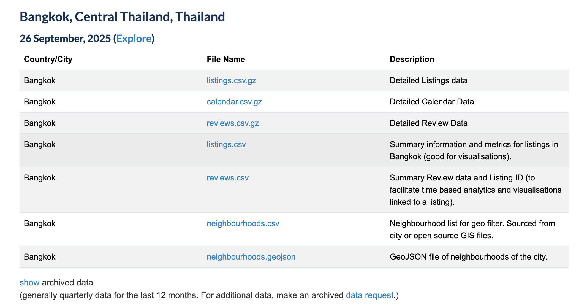
</p>

### 💾 Data Profiling & Complexity
The raw data contains over **70+ columns** with mixed types (JSON-like strings, uncleaned currency).

> **Challenge:** Fields like `bathrooms_text` are unstructured (e.g., "1.5 baths", "Half-bath"). We use Regex parsing and safe casting to normalize them.
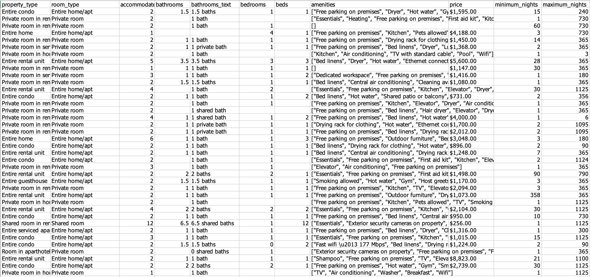

### 📋 Dictionary Overview

| Table | File Name | Key Columns & Descriptions |
| :--- | :--- | :--- |
| **Listings** | `listings.csv.gz` | **Main Dimension.** 70+ attributes including `bathrooms_text` (mixed) and `amenities` (array). |
| **Calendar** | `calendar.csv.gz` | **Fact Table.** Daily availability & pricing. Contains `available` ('t'/'f'). |
| **Reviews** | `reviews.csv.gz` | **Unstructured Data.** `comments` field used for **Sentiment Analysis**. |
| **Seeds** | `neighborhoods.csv` | **Static Reference.** Curated list of Bangkok districts. |

### 🔗 Entity Relationships (Raw Layer)
Tables are linked via `listing_id`, forming the base for the Star Schema.


## 🔄 5. Data Pipeline Implementation

### 5.1 Ingestion (Extract & Load)
* **Tool:** Airbyte
* **Source:** AWS S3 (Daily CSV.gz)
* **Destination:** Snowflake `RAW` schema

---

## 5.2 Transformation Layers (dbt)

I structured the data pipeline using the **Medallion Architecture**, moving data through three stages to ensure quality and trust.

### 🥉 Bronze Layer (Raw Data)
*Where raw data lands and stays untouched.*
- **Ingestion:** Raw CSV and JSON files from **AWS S3** are loaded directly here via **Airbyte**.
- **Immutable:** I keep this layer 100% original (no edits). If anything breaks downstream, I can always rebuild from this exact point.

### 🥈 Silver Layer (Staging & Cleaning)
*The cleanup zone. This is where raw data gets fixed and standardized.*
- **Parsing Messy Text:** Used **SQL Regex** in `stg_listings` to extract actual numbers from unstructured text fields like `bathrooms_text`.
- **Custom Macros:** Built a `clean_price` macro to automatically strip currency symbols (`$`, `,`) and fix data types across all models.
- **Preparation:** Standardized everything (handling NULLs, casting types) so the data is clean before joining.

### 🥇 Gold Layer (Marts & Serving)
*The final layer. Data here is modeled and ready for dashboards.*
- **Star Schema:** Built the central **Fact tables** (`fct_reviews`, `fct_daily_activity`) and **Dimension tables** (`dim_listings`) to make queries fast and efficient.
- **Tracking History:** Implemented **SCD Type 2** snapshots. This lets us "time travel" to see how listing prices or host statuses changed in the past.
- **Business Metrics:** Aggregated data from `fct_daily_activity` to calculate key metrics like **Occupancy Rate** and **Average Daily Price** by neighborhood.

## 🤖 6. Machine Learning & GenAI Integration
Python-based ML models are integrated directly into the pipeline, running on **Snowflake Compute** (via Snowpark). This avoids external data movement.

### 6.1 Market Segmentation (K-Means Clustering)
* **Objective:** Group listings to understand supply patterns.
* **Model:** K-Means (k=4) with PCA.
* **Implementation:** `models/machine_learning/cluster_listings.py`

> **Visual Insight:** PCA plot showing 4 distinct clusters.
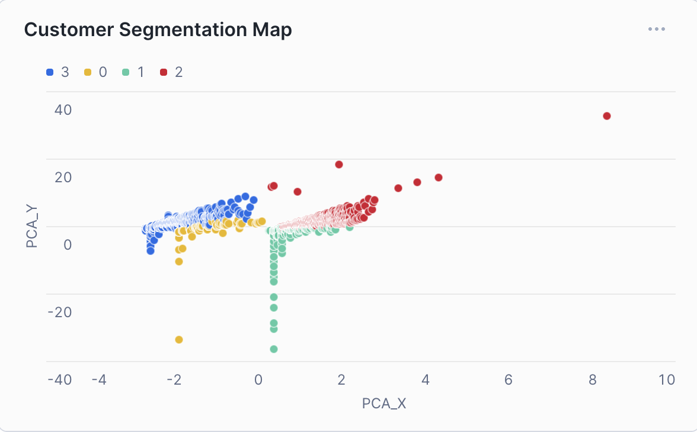

---

### 6.2 Price Prediction (XGBoost)
* **Objective:** Estimate "Fair Price" based on reviews and location type.
* **Model:** XGBoost Regressor.
* **Implementation:** `models/machine_learning/predict_price.py`

> **Model Performance:** Actual vs. Predicted Price.
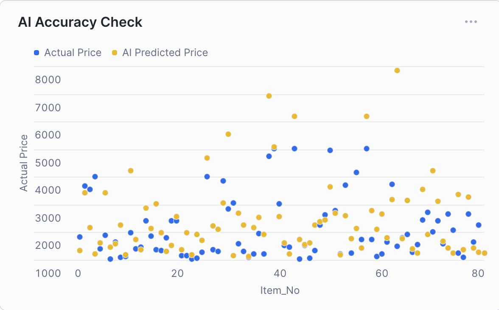

---

### 6.3 Anomaly Detection (Isolation Forest)
* **Objective:** Flag potential pricing errors or fraud (e.g., > 1M THB).
* **Model:** Isolation Forest (Contamination = 1%).
* **Implementation:** `models/machine_learning/detect_anomalies.py`

> **Detected Outliers:** Listings with extreme pricing anomalies.
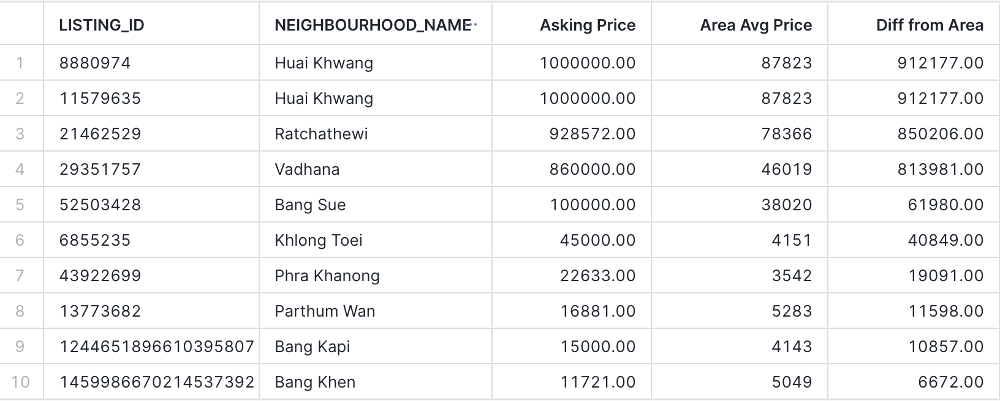

---

### 6.4 Sentiment Analysis (Snowflake Cortex)
* **Objective:** Analyze sentiment of textual reviews beyond star ratings.
* **Tech:** **Snowflake Cortex** (LLM).
* **Implementation:** `models/core/mart_sentiment.sql`

**SQL Logic Spotlight:**
```sql
SELECT
    review_text,
    SNOWFLAKE.CORTEX.SENTIMENT(review_text) AS sentiment_score
FROM reviews
```
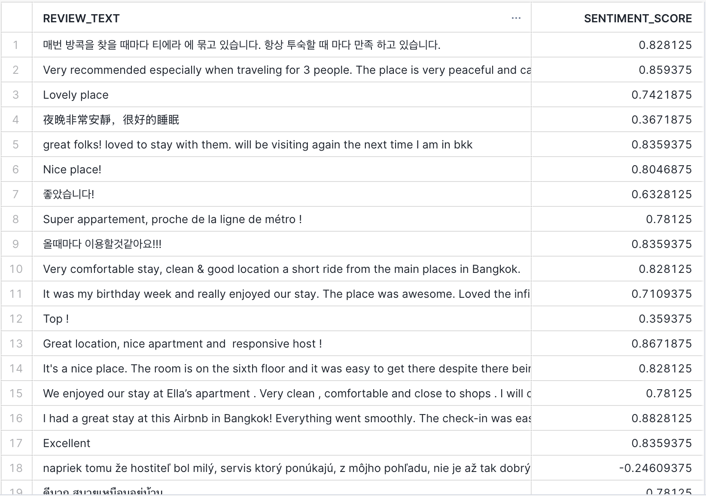
**Output**: Positive/negative sentiment scores (-1 to +1).

## 🛡 7. Data Governance & Quality
Reliability and security are built into the pipeline to ensure trust and compliance.

### 7.1 Automated Data Quality Testing
We employ **dbt tests** to validate data integrity at every stage.

* **Generic Tests:** `unique`, `not_null`, `accepted_values` checks on primary keys.
* **Custom Tests:** Domain-specific logic to catch edge cases.
    * *Example:* `assert_no_future_reviews.sql` ensures no reviews have dates in the future.

> **Quality Assurance:** All automated tests passed successfully.


---

### 7.2 Data Privacy & Security (Dynamic Masking)
Implemented **Snowflake Dynamic Masking Policies** to comply with PDPA/GDPR standards.

* **Policy:** `host_mask`
* **Logic:** The `ANALYST` role sees obscured data (`***MASKED***`), while authorized roles see actual host names.

**Implementation:**


> **Security in Action:** Screenshot showing PII masking for unauthorized roles.
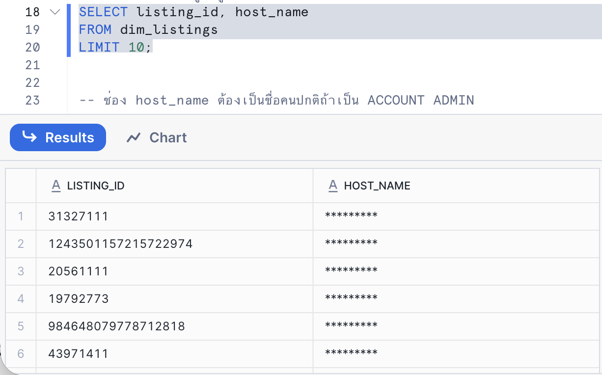

## ♻️ Disaster Recovery & Resilience
To ensure high availability and data durability, the pipeline implements several recovery strategies:

* **Version Control as Single Source of Truth:** All transformation logic (dbt) and pipeline configurations are version-controlled in **GitHub**. In case of a dbt Cloud outage, the pipeline can be executed locally using `dbt-core`.
* **Snowflake Time Travel:** Enabled on critical tables to allow historical data recovery (undrop/select at timestamp) in case of accidental deletion or corruption during updates.
* **Idempotent Pipelines:** The Airbyte ingestion (Full Refresh) and dbt models (Table/View materialization) are designed to be **idempotent**. Rerunning the pipeline multiple times produces the same consistent state without data duplication.
* **Raw Data Durability:** Source data remains untouched in **AWS S3** (High Durability), serving as a permanent backup that can be re-ingested at any time.

## 📊 8. Analytics & Dashboards
Final dashboards are built in **Snowsight** to visualize market trends and model outputs.

### 🏙️ 8.1 Market & Location Overview
High-level summary of the Bangkok market supply.
* **Key KPIs:** Total Listings, Avg Daily Price, Neighborhood coverage.
* **Top Locations:** Ranking of most popular districts by listing count.
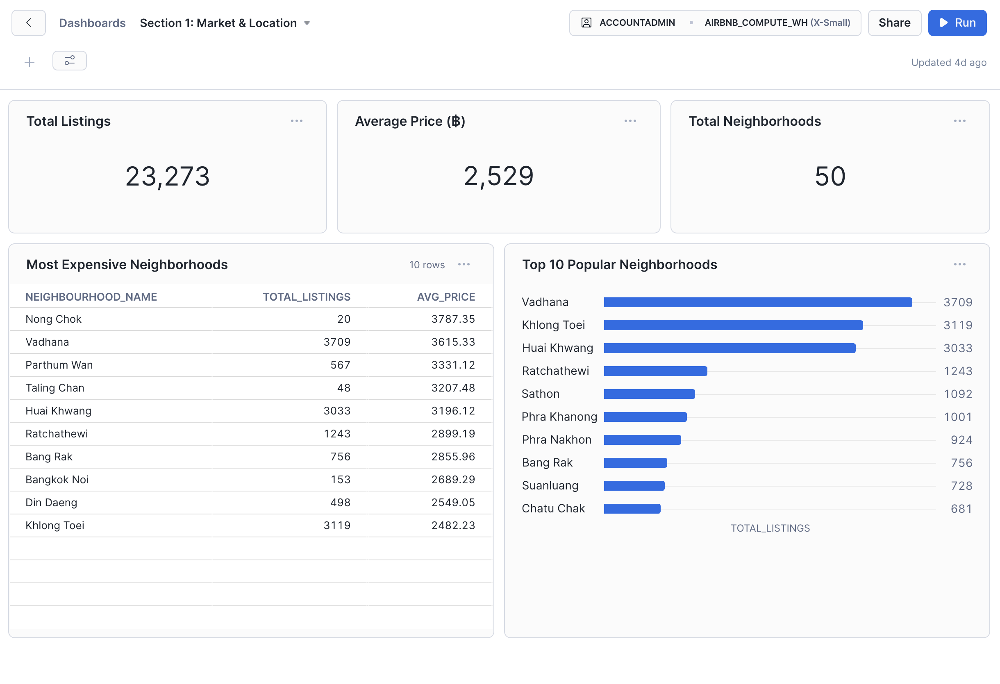

---

### 🛏️ 8.2 Product & Price Analysis
Focuses on inventory distribution and pricing strategy.
* **Room Type vs. Price:** Comparison of Entire Home/apt, Shared rooms, Private room and Hotel.
* **Statistical Summary:** Benchmark rates (Min/Max/Avg) to aid pricing decisions.
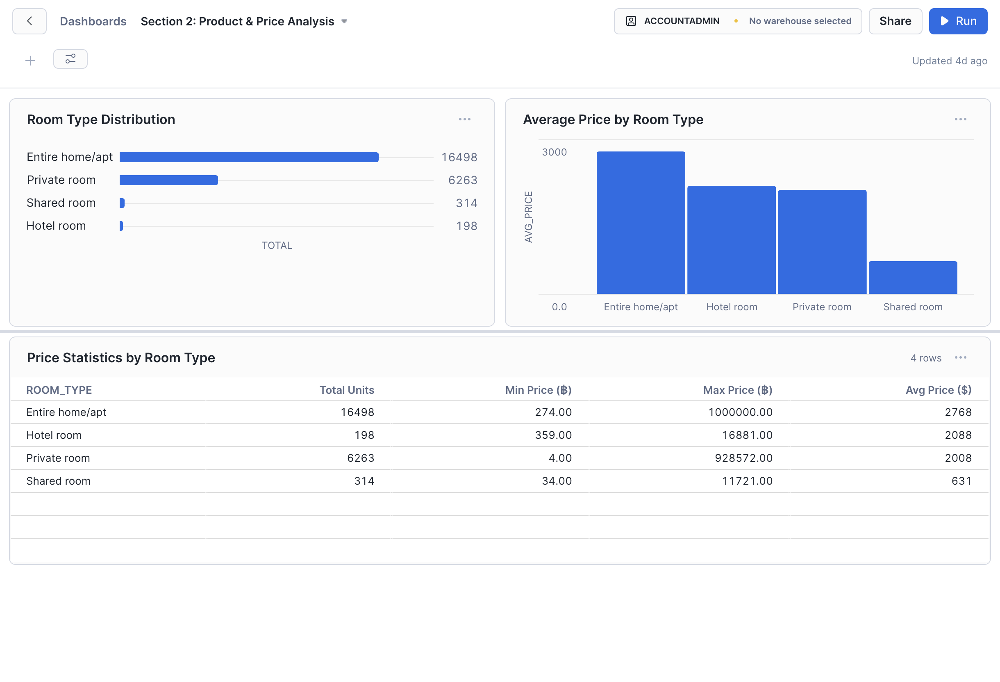

---

### 🧠 8.3 AI-Driven Insights
Visualization of Machine Learning and GenAI results.
* **Customer Segmentation:** K-Means clusters visualized via PCA.
* **Anomaly Detection:** Outliers flagged by Isolation Forest (e.g., extreme pricing).
* **Price Prediction:** Actual vs. Predicted price scatter plot.
* **Sentiment Analysis:** Review sentiment scores from Snowflake Cortex.
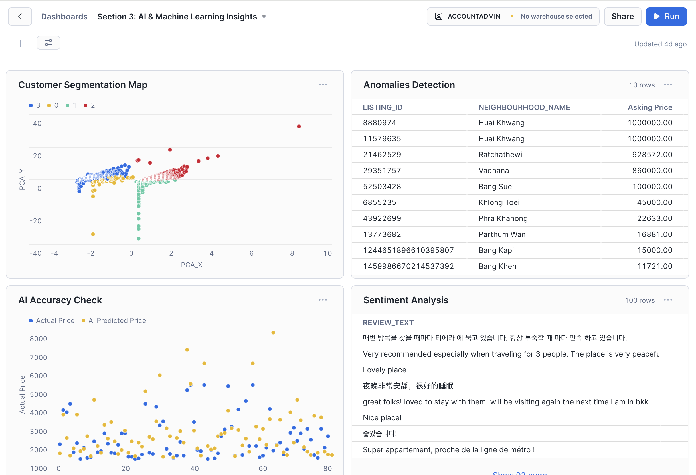

## 💻 9. Quick Start (Workflow Demo)
Demonstration of the production workflow execution.

### 1️⃣ Execution (Build & Run)
Triggering the full ELT process, including SQL transformations and Python ML models.

```bash
dbt deps      # Install dependencies (dbt_utils)
dbt seed      # Load static neighborhood data
dbt run       # Execute all models (SQL & Python)
```

### 2️⃣ Validation (Test)
Ensuring data integrity immediately after execution.

```bash
dbt test      # Run automated tests (Unique, Not Null, Custom Logic)
```
