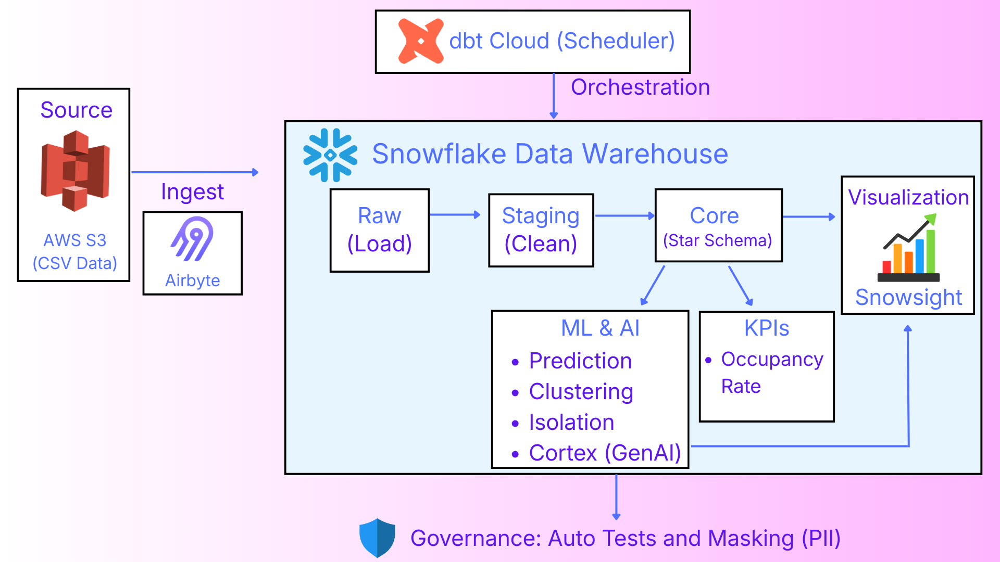
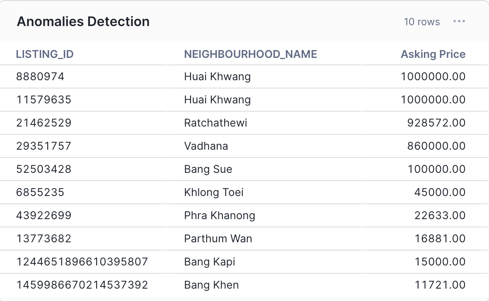

# 🏡 Airbnb Bangkok Data Pipeline: End-to-End ELT & ML Project


---
## 📖 Table of Contents
1. [Project Overview](#-1-project-overview)
2. [Architecture & Workflow](#-2-architecture--workflow)
3. [Tech Stack & Tools](#-3-tech-stack--tools)
4. [Data Source & Dictionary](#-4-data-source--dictionary)
5. [Data Pipeline Implementation](#-5-data-pipeline-implementation)
6. [Machine Learning & GenAI Integration](#-6-machine-learning--genai-integration)
7. [Data Governance & Quality](#-7-data-governance--quality)
8. [Analytics & Dashboards](#-8-analytics--dashboards)
9. [Quick Start](#-9-quick-start-workflow-demo)

---

## 📌 1. Project Overview
This project demonstrates a production-grade **End-to-End ELT Data Pipeline** integrated with **Machine Learning** and **Generative AI**.

The goal is to ingest raw Airbnb data for Bangkok, transform it into a clean analytical format using the **Modern Data Stack**, and uncover hidden market insights using advanced predictive models.

### 🎯 Key Objectives
* **Automated Orchestration:** Fully automated daily syncs and transformation jobs scheduled via **dbt Cloud**.
* **Data Transformation:** Built a modular Data Warehouse (Star Schema) with **SCD Type 2** snapshots to track historical changes.
* **Predictive Modeling:** Developed an **XGBoost Regression** model to predict fair listing prices based on room type and amenities.
* **Advanced Analytics:** Implemented **K-Means Clustering** for market segmentation and **Isolation Forest** for anomaly detection.
* **GenAI Integration:** Leveraged **Snowflake Cortex** to perform Sentiment Analysis on guest reviews.
* **Governance & Quality:** Enforced data quality via **Custom SQL Tests** and implemented **Dynamic Masking Policies** to protect PII (Host Names).

## 🏗 2. Architecture & Workflow
The pipeline operates on a **Modern Data Stack**, fully hosted on the cloud. The workflow is designed to be modular, scalable, and automated.

<p align="center">
  
</p>

### 🔄 End-to-End Data Flow

#### 1. Data Ingestion (EL)
* **Source:** Raw Airbnb data (`Listings`, `Calendar`, `Reviews`) is stored in **AWS S3**.
* **Ingestion:** **Airbyte** connects to the S3 bucket and syncs data into **Snowflake** (`RAW` Schema).
* **Frequency:** Automated daily jobs.


#### 2. Orchestration & Scheduling (New!)
* **Automation:** The entire pipeline is scheduled via **dbt Cloud Jobs** to run daily at 07:00 AM.
* **Monitoring:** Automatic alerts are triggered via email/Slack if any job fails.

> **Production Deployment:** Daily automated runs ensure data freshness without manual intervention.


#### 3. Data Storage (Snowflake)
* **Raw Layer:** Stores unprocessed JSON/CSV data loaded by Airbyte.
* **Analytics Layer:** Organized into `Staging`, `Core`, and `Marts` schemas for efficient querying.

#### 4. Data Transformation (dbt)
Data is transformed through a layered architecture, orchestrated by **dbt Cloud**:
* **Staging:** Cleans raw data (regex parsing, deduplication, currency casting).
* **Core:** Joins tables into a **Star Schema** (`dim_listings`, `fct_reviews`, `fct_daily_activity`).
* **Marts:** Aggregates metrics for reporting.

> **Data Lineage:** The diagram below illustrates the dependency graph of our dbt models, including Python ML nodes.


#### 5. Machine Learning & AI
* **Environment:** Python logic is defined in **dbt Python models**, running natively on **Snowflake Compute** (via Snowpark).
* **Integration:** ML outputs (Predictions, Clusters, Anomalies) are written back as tables in the warehouse, ready for analysis.

## 🛠 3. Tech Stack & Tools
The project leverages industry-standard tools for Data Engineering and Machine Learning.

| Category | Tool | Description |
| :--- | :--- | :--- |
| **Cloud Storage** |  | Acts as the Data Lake storing raw CSV files (Listings, Calendar, Reviews). |
| **Ingestion** |  | Open-source ELT tool used to sync data from S3 to Snowflake. |
| **Data Warehouse** |  | Scalable Cloud Data Warehouse handling Raw, Staging, and Mart layers. |
| **Transformation** |  | Handles data modeling, testing, and documentation (dbt Cloud). |
| **Language** |  | Used for Machine Learning models (Scikit-learn, XGBoost) running in Snowflake. |
| **GenAI** |  | Snowflake's managed LLM service for Sentiment Analysis. |
| **Orchestration** |  | Schedules daily jobs |
| **Visualization** |  | Native Snowflake dashboards for monitoring metrics and ML results. |

---

### 📂 Project Directory Structure
A quick look at how the dbt project is organized:

```text
├── 📂 models
│   ├── 📂 staging          # Cleaning raw data (Regex, Casting)
│   ├── 📂 core             # Dimension & Fact tables (Star Schema)
│   ├── 📂 aggregate        # Final reporting metrics
│   └── 📂 machine_learning # Python scripts (Clustering, Prediction)
├── 📂 macros               # Custom SQL logic (clean_price)
├── 📂 seeds                # Static data (neighborhoods.csv)
├── 📂 snapshots            # SCD Type 2 tracking
├── 📂 tests                # Custom data quality checks
├── .gitignore
├── package.yml
├── package-lock.yml
└── dbt_project.yml         # Project configuration

```

## 📂 4. Data Source & Dictionary
The dataset is sourced from **Inside Airbnb** (Bangkok), comprising three primary files with complex schemas and unstructured fields.

<p align="center">
  
</p>

### 💾 Data Profiling & Complexity
We handle raw data with over **70+ columns**, containing mixed types (JSON-like strings, uncleaned currency, boolean-as-text).

> **Challenge:** The raw data contains unstructured text (e.g., `bathrooms_text`) and currency symbols that require Regex parsing and Casting.


### 📋 Dictionary Overview

| Table | File Name | Key Columns & Descriptions |
| :--- | :--- | :--- |
| **Listings** | `listings.csv.gz` | **Main Dimension.** Contains 70+ attributes including `bathrooms_text` (mixed), `amenities` (array), and `price` (string with '$'). |
| **Calendar** | `calendar.csv.gz` | **Fact Table.** High-volume daily availability & pricing. Contains `available` ('t'/'f') and `adjusted_price`. |
| **Reviews** | `reviews.csv.gz` | **Unstructured Data.** Contains `comments` used for **Sentiment Analysis**. Key linkage via `listing_id`. |
| **Seeds** | `neighborhoods.csv` | **Static Reference.** A manually curated list of Bangkok districts for clean joining. |

### 🔗 Entity Relationships (Raw Layer)
The raw tables are interconnected via `listing_id`, forming the foundation of our Star Schema.


## 🔄 5. Data Pipeline Implementation
This section details the ELT process, focusing on the transformation logic applied within dbt to turn raw, messy data into a clean, business-ready star schema.

### 5.1 Ingestion (Extract & Load)
* **Tool:** Airbyte automated daily sync.
* **Source:** AWS S3 bucket containing daily updated CSV.gz files.
* **Destination:** Snowflake `RAW` schema (loading data as-is).

---

### 5.2 Transformation Layers (dbt)
Our dbt project follows a structured, three-layer architecture, ensuring modularity and maintainability.

#### 🥉 Bronze Layer (Staging)
Here, we handle data cleaning, type casting, and standardize naming conventions.

**Key Implementations:**
* **Complex Text Parsing via Regex:** Raw `bathrooms_text` is highly unstructured (e.g., "1.5 baths", "Half-bath", "Shared half-bath"). We use advanced SQL regex logic to extract cleanly formatted numeric values.

> **Code Spotlight:** Regex logic implemented in `stg_listings.sql` to parse unstructured bathroom data.


* **Reusable Macros for Currency Cleaning:** Created a DRY (Don't Repeat Yourself) macro `clean_price` to handle currency symbols (`$`, `,`) and perform safe casting across multiple staging models.

> **Macro in Action:** Defining the `clean_price` macro and applying it in staging models.


---

#### 🥈 Silver Layer (Core & Snapshots)
In this layer, we build our Dimensional Model and track historical data.

* **Dimensional Modeling (Star Schema):** We transform staging tables into conformed Dimensions (`dim_listings`) and Facts (`fct_reviews`, `fct_daily_activity`), linking them via surrogate keys.

### 🌟 Star Schema Design
The core layer is designed around a central Listing dimension linking various transactional facts.


* **SCD Type 2 Snapshots:** We implement dbt snapshots to track changes in critical attributes over time (e.g., price changes, host status updates), preserving history for trend analysis.

> **Historical Tracking:** Capturing dimension changes using SCD Type 2 snapshots.


---

#### 🥇 Gold Layer (Marts)
The final layer contains aggregated tables optimized for BI and reporting tools like Snowsight.

* **Aggregated Metrics:** The `agg_daily_neighborhood_performance` table pre-calculates key KPIs like daily average price and occupancy rate per district.

> **Analytics-Ready Data:** A preview of the final aggregated neighborhood metrics table ready for visualization.


## 🤖 6. Machine Learning & GenAI Integration
A key differentiator of this project is the integration of Python-based ML models directly within the Snowflake data pipeline, eliminating the need for external processing.

### 6.1 Market Segmentation (K-Means Clustering)
* **Objective:** Group listings into distinct market segments to understand supply patterns.
* **Model:** K-Means (k=4) with PCA for dimensionality reduction.
* **Implementation:** `models/machine_learning/cluster_listings.py`

> **Visual Insight:** The PCA visualization below reveals 4 distinct clusters ranging from "Budget/Solo" to "High-End/Family" units.


---

### 6.2 Price Prediction (XGBoost)
* **Objective:** Estimate the "Fair Price" of a listing based on its features (Location, Room Type, Amenities) to identify under/overpriced units.
* **Model:** XGBoost Regressor.
* **Implementation:** `models/machine_learning/predict_price.py`

> **Model Performance:** The scatter plot compares Actual Price vs. AI Predicted Price.


---

### 6.3 Anomaly Detection (Isolation Forest)
* **Objective:** Automatically flag potential pricing errors or fraud (e.g., a room priced at 1,000,000 THB).
* **Model:** Isolation Forest (Contamination = 1%).
* **Implementation:** `models/machine_learning/detect_anomalies.py`

> **Detected Outliers:** The model successfully flagged listings with extreme pricing anomalies (e.g., > 1M THB) for review.


---

### 6.4 Sentiment Analysis (Snowflake Cortex)
* **Objective:** Go beyond star ratings by analyzing the *sentiment* of textual reviews.
* **Tech:** **Snowflake Cortex** (LLM-based function).
* **Implementation:** `models/core/mart_sentiment.sql`

**SQL Logic Spotlight:**
```sql
SELECT 
    review_text,
    SNOWFLAKE.CORTEX.SENTIMENT(review_text) AS sentiment_score
FROM reviews
```
**AI-Powered Feedback**: Classifying guest reviews into positive/negative sentiment scores (-1 to +1).

## 🛡 7. Data Governance & Quality
Reliability and security are built into the pipeline, ensuring that stakeholders can trust the data and that PII (Personally Identifiable Information) remains protected.

### 7.1 Automated Data Quality Testing
We employ **dbt tests** to validate data integrity at every stage of the pipeline.

* **Generic Tests:** Enforced `unique`, `not_null`, and `accepted_values` checks on primary keys and categorical fields.
* **Custom Business Logic:** Implemented custom SQL tests to catch domain-specific errors.
    * *Example:* `assert_no_future_reviews.sql` ensures no reviews have dates in the future.

> **Quality Assurance:** All models pass rigorous automated testing suites.


---

### 7.2 Data Privacy & Security (Dynamic Masking)
To comply with data privacy standards (PDPA/GDPR), we implemented **Snowflake Dynamic Masking Policies**.

* **Policy:** `host_mask`
* **Logic:** Users with the `ANALYST` role see obscured data (`***MASKED***`), while authorized roles see the actual host names.

**Implementation:**


> **Security in Action:** The screenshot below demonstrates PII masking applied to the `host_name` column for unauthorized roles.


## 📊 8. Analytics & Dashboards
The final data products are visualized using **Snowsight**, providing interactive dashboards that bridge the gap between raw data and actionable business insights.

### 🏙️ 8.1 Market & Location Overview

This dashboard provides a high-level summary of the Bangkok Airbnb market supply.
* **Key KPIs:** Real-time metrics showing Total Listings (23k+), Average Nightly Price, and Total Neighborhoods coverage.
* **Top Locations:** A horizontal **Bar Chart** ranking the top 10 most popular neighborhoods by listing count (e.g., Vadhana, Khlong Toei).
* **Price Analysis:** A table highlighting the most expensive neighborhoods to help identify premium districts.


---

### 🛏️ 8.2 Product & Price Analysis

Focused on inventory distribution and pricing strategy across different accommodation types.
* **Room Type Distribution:** A bar chart revealing that "Entire home/apt" is the dominant listing type, followed by "Private rooms".
* **Price vs. Room Type:** A column chart comparing the average price per room type, showing clear price tiers between Hotel rooms/Entire homes and Shared rooms.
* **Statistical Summary:** A detailed table providing Min, Max, and Average prices to help hosts benchmark their rates against the market.


---

### 🧠 8.3 AI-Driven Insights (Machine Learning & GenAI)

This section showcases the output of our **In-Database Machine Learning** and **GenAI** models.

* **Customer Segmentation (Top-Left):** K-Means clustering results visualized via PCA, distinctively grouping listings based on features.
* **Anomaly Detection (Top-Right):** **Isolation Forest** results flagging specific listings with extreme pricing (e.g., 1M THB) as potential outliers.
* **Price Prediction Accuracy (Bottom-Left):** Scatter plot comparing Actual Price vs. **XGBoost** Predicted Price to validate model performance.
* **Sentiment Analysis (Bottom-Right):** Leveraging **Snowflake Cortex** to generate sentiment scores from unstructured guest reviews.


## 💻 9. Quick Start (Workflow Demo)
Since this pipeline requires specific Snowflake credentials and AWS keys, here is a demonstration of how the automated workflow is executed in the production environment.

### 1️⃣ Execution (Build & Run)
The entire ELT process—from staging to machine learning models—is triggered by standard dbt commands.

```bash
dbt deps      # Install packages (dbt_utils)
dbt seed      # Load static neighborhood data
dbt run       # Execute all SQL transformations & Python ML models
```
### 2️⃣ Validation (Test)
Data quality checks are performed immediately after execution to ensure no bad data enters the dashboard.

```bash
dbt test      # Run 50+ automated tests (Unique, Not Null, Custom Logic)
```
